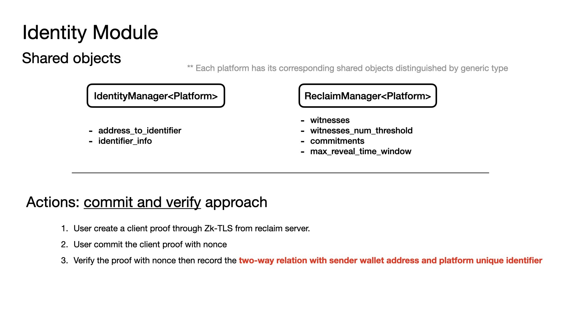

# Zing - Decentralized Content Creation Platform

Zing is a comprehensive decentralized platform built on Sui blockchain that enables content creators to publish, monetize, and manage their digital works with built-in storage, subscription, and identity verification systems.

## 🌟 Overview

Zing consists of multiple interconnected modules that provide a complete ecosystem for content creators:

- **ZingStudio**: Personal studios for content creation and management
- **ZingIdentity**: Decentralized identity verification system
- **ZingGovernance**: Governance and treasury management
- **ZingFramework**: Core utilities and data structures

## 🏗️ Architecture





```
                  ┌────────────────────────────┐
                  │        Seal Service        │
                  │ (Root KMS / Access Policy) │
                  └─────────────┬──────────────┘
                                │
                       Seal encrypts FileKey
                                ▼
                 ┌──────────────────────────────┐
                 │        Encrypted FileKey     │
                 │ (stored with file metadata)  │
                 └─────────────┬────────────────┘
                               │
                       Request from user
                               │
                               ▼
       ┌───────────────────────────────────────────────┐
       │               TEE (Nitro Enclave)             │
       │-----------------------------------------------│
       │ • Authenticates requester (linked wallet)     │
       │ • Calls Seal once to decrypt FileKey          │
       │ • Caches decrypted FileKey in secure memory   │
       │ • Uses FileKey (AES-256-GCM) to encrypt/      │
       │   decrypt file content locally                │
       └───────────────────────────────────────────────┘
                               │
                               ▼
                    ┌────────────────────┐
                    │   Encrypted File   │
                    │ (stored via Walrus)│
                    └────────────────────┘
```

**Flow Description:**
1. **Seal Service** encrypts the FileKey using root KMS and access policies
2. **Encrypted FileKey** is stored alongside file metadata
3. **User Request** triggers the decryption process
4. **TEE (Nitro Enclave)** securely handles the decryption:
   - Authenticates the requester via linked wallet
   - Calls Seal service to decrypt the FileKey
   - Caches the decrypted FileKey in secure memory
   - Uses FileKey for local file encryption/decryption
5. **Encrypted File** is stored on Walrus for decentralized storage

### Core Components

#### 1. Studio System
- **Personal Studios**: Each creator has a unique studio (shared object) for managing their content
- **Content Management**: Support for articles with blob storage on Walrus
- **Subscription Model**: Monthly subscription fees for accessing premium content
- **Membership System**: Time-based access control for subscribers

#### 2. Storage Management
- **Walrus Integration**: Decentralized storage using Walrus protocol
- **Storage Treasury**: Centralized pool for managing storage resources across epochs
- **Tiered Storage Plans**: Multiple storage tiers with different pricing and limits
- **Automatic Renewal**: Storage can be extended before expiration

#### 3. Identity & Access Control
- **Decentralized Identity**: Verifiable identity system for creators and users
- **Seal-based Access**: Cryptographic access control for premium content
- **Platform Integration**: Support for external identity platforms

#### 4. Economic Model
- **Subscription Fees**: USD-denominated monthly fees for content access
- **Storage Costs**: WAL token payments for storage operations
- **Donation System**: Direct support mechanism for creators
- **Treasury Management**: Governance-controlled treasury operations
